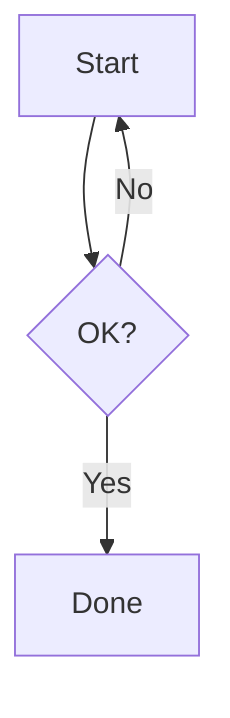

# Normal-pipeline feature syntax

Syntax for a flowing document (non-Marp). All of these also work inside Marp slides unless
noted. Canonical examples are bundled with this skill under `samples/` (paths below are
relative to this skill directory).

## Standard base (always available)

CommonMark + GFM: headings (`#`–`######`), `**bold**`, `*italic*`, `~~strike~~`, `` `code` ``,
fenced code blocks (```` ```lang ````, syntax-highlighted, copy button auto-added), pipe
tables, `- ` / `1. ` lists, `- [ ]` / `- [x]` task lists, `> ` blockquotes, `---` rules,
`[text](url)` links, `` images.

Code fences are highlighted by highlight.js; on top of its usual languages the previewer
ships an in-house `modelica` grammar, so ```` ```modelica ```` is a real choice here.

**Nested lists:** indent a child to the column just after the parent marker — `- ` items by
2 spaces, `1. ` items by 3 spaces (`10. ` by 4). Misaligned indentation breaks nesting.

**Task lists are live** — `samples/tasklist.md`. The reader can click a rendered checkbox and
the previewer rewrites that one `- [ ]` / `- [x]` line in the file, in the normal preview and
in Marp slides alike. So a checklist you write is a checklist the reader can actually tick
off; prefer it over a table with a 状態 column when the document is meant to be worked
through. Write the marker exactly `- [ ] ` / `- [x] ` (one space after `]`) — anything else
renders as literal text.

## Fenced divs (Pandoc-style) — `samples/alignment.md`

Open with `::: keyword`, close with a bare `:::`. The block body is normal Markdown.

```markdown
::: center
## Centered heading
Centered paragraph.
:::

::: right
出典：『○○白書』2026 年版
:::

::: left
Left-aligned (useful inside a vertical-writing theme).
:::

::: message
締切は 6 月 20 日（金）です
:::
```

- `center` / `right` / `left` — text alignment wrapper.
- `message` — emphasized centered key-message (big bold text + thin accent rules).

**Multi-column** with `::: columns` (or `columns-2` / `-3` / `-4` to force a count),
dividing columns with a `+++` line:

```markdown
::: columns
**Left column**

Content A.
+++
**Right column**

Content B.
:::
```

Count = explicit `columns-N` if given, else the number of `+++`-separated buckets (2–4).
Limitation: a nested `:::` (e.g. `::: center` inside a column) is **not** supported in the
normal pipeline — use Marp for nesting.

## Inline styled spans — `samples/inline-style.md`

`[text]{key=value ...}` sets per-run styling. Keys (case-insensitive, short forms in
parens): `color`/`c`, `bg`/`background`, `size`/`s`, `font`/`f`, `weight`/`w`, `valign`/`v`.

```markdown
[赤い文字]{color=red}  [ピンク背景]{bg=#fff3cd}
[小]{size=small} [大]{size=large} [特大]{size=xxl} [任意]{size=1.4em}
[明朝]{font=serif} [等幅]{font=mono} [名前指定]{font="Comic Sans MS"}
[細字]{weight=light} [太字]{weight=bold} [数値]{weight=600}
大[中央寄せの小文字]{size=small valign=middle}文字
[重要・赤・大・太]{color=red size=large weight=bold}
[**太字**や`コード`も入れられる青字]{color=navy}
```

- `size`: `xs/sm/small/md/normal/lg/large/xl/xxl` or a length (`1.4em`/`120%`/`20px`).
- `font`: `serif`/`sans`/`mono` or a family name (quote if it has spaces).
- `weight`: `thin`…`black`, `100`–`900`, `bold`, `normal`.
- `valign`: `middle`(center)/`top`/`bottom`/`baseline`/`sub`/`super` or a length.

Only fires when ≥1 valid property is present, so ordinary `[label](url)` links are untouched.

## Ruby / 振り仮名 — `samples/ruby.md`

Reading annotations, でんでんマークダウン syntax. Three forms, all producing `<ruby>`:

```markdown
吾輩は｜猫《ねこ》である。          <- bar form: the base is spelled out after ｜
お天気《てんき》の良い日            <- short form: the kanji run before 《 is the base
{吾輩|わがはい}は                   <- brace form: half- or full-width | splits base/reading
{漢字|かん|じ}  ｜東京《とう|きょう》 <- mono ruby: one reading per base character
\｜ \《 \》                         <- escapes
```

- **Mono ruby only when the counts match.** `{漢字|かん|じ}` has 2 segments for 2 characters, so
  each lands on its own character. `{五月雨|さみ|だれ}` (2 for 3) falls back to group ruby.
- **The base is plain text** — no `**bold**` inside. Wrap the whole thing: `**｜強調《きょうちょう》した語**`.
- **Not usable in a GFM table cell** in the brace form (`|` splits the cell first) — use the bar or
  short form there, or escape as `\|`.
- A `《…》` used as a quotation right after kanji becomes a ruby; write `\《` to opt out.
- Works in Marp slides too, and carries into HTML / PDF export.
- **Vertical writing**: ruby appears on the right of the column automatically. Under `bunko.css` the
  annotation is kept out of the 行取り grid; for ruby-heavy prose, widen 行送り to ~1.9–2.1 via the ⚙.

## Footnotes — `samples/footnotes.md`

```markdown
Some claim.[^1]  Another point.[^note]

[^1]: A short footnote.
[^note]: A longer one.

    Indent continuation paragraphs by four spaces.
```

References render as superscripts with hover tooltips; a Footnotes section is appended.
Math works inside footnote bodies. Non-ASCII ids (`[^日本語]`) are fine.

## Definition lists — `samples/deflist.md`

Pandoc / PHP Markdown Extra style: a term line, then one or more lines starting with `: `
(colon + space). Consecutive term/definition groups separated by blank lines merge into one
list. Works in the normal pipeline and in Marp slides. Good for glossaries and 用語集 —
prefer it over a two-column table when the definitions are prose.

```markdown
Markdown
: プレーンテキストに書式を与える軽量マークアップ言語。

プレビュー
: 編集中の Markdown を整形表示する画面。
: ファイルの外部変更を検知して自動で再読み込みされる。
```

## Mermaid diagrams — `samples/sample.md`

````markdown

````

Optional first line `scale: 1.5` enlarges the rendered diagram (handy on Marp slides).
Supports flowcharts, sequence, pie, etc.

## CSV / TSV tables — `samples/csv-tsv.md`

First row becomes the header. `csv` follows RFC 4180 (quote fields with commas/newlines;
`""` = a literal quote). `tsv` splits on tabs, no quoting.

````markdown
```csv
Name,Role,Quote
Alice,Engineer,"Hello, world"
Bob,"Senior, Staff","He said ""ship it"""
```
````

## Plotly charts from external data — `samples/plotly.md`

A `plotly` block holds a YAML spec referencing an external `.csv`/`.tsv` (path relative to
the `.md` — **the file must exist alongside the document**).

````markdown
```plotly
file: data/sales.csv
type: line
x: month
y: [revenue, cost]
names: [Revenue, Cost]
title: Revenue vs Cost
layout:
  height: 420
```
````

`type:` ∈ `line`, `scatter`, `bar`, `histogram`, `box`, `heatmap`, `surface` (heatmap/surface
read the CSV as a matrix: row 0 → x labels, col 0 → y labels, cells → z). `y:` may be a list.
Full control via a `traces:` list. Optional `layout:` / `config:` deep-merge into Plotly.

## ABC music notation — `samples/abcjs.md`

Sheet music, with a hover-revealed playback bar under each staff (piano only; the
sound bank is an optional install, and the bar says so when it is absent). Exports
carry the staff as inline SVG — never the playback controls.

````markdown
```abc
X:1
T:きらきら星
M:4/4
L:1/4
K:C
C C G G | A A G2 | F F E E | D D C2 |
```
````

## Markwhen timelines — `samples/markwhen.md`

A `markwhen` fence renders a horizontal cascade timeline. Sections are `#`–`######` headings,
a ranged event is `start / end: label`, a single event is `date: label`, tags are `#tag` and
get their colour from an optional front-matter block inside the fence.

````markdown
```markwhen
---
title: プロジェクト計画
#design: blue
#dev: green
---

# 企画
2023-01-01 / 2023-02-15: 要件定義 #design
2023-02-01: キックオフ

# 開発
2023-03-01 / 2023-06-30: API 実装 #dev
```
````

Add `display: calendar` (or `calendar: true`) in the header for a month-grid calendar instead.
Two caveats worth knowing while authoring: a span wider than ~36 months **falls back to the
timeline**, and holidays are fetched online only — offline it renders without them, never an
error.

## TikZ & commutative diagrams — `samples/tikzcd.md`

A `tikzcd` fence is wrapped in a `tikzcd` environment automatically; a `tikz` fence takes a
raw `\begin{tikzpicture}`. Both compile through a bundled WASM TeX engine to inline SVG, so
they survive HTML/PDF export and follow the theme colour. An optional first line
`scale: <factor>` overrides the default 1.6× enlargement.

````markdown
```tikzcd
A \arrow[r, "f"] \arrow[d, "g"'] & B \arrow[d, "h"] \\
C \arrow[r, "k"']                & D
```
````

⚠ **The TikZ engine is an optional download in the installer** (the "tikz" checkbox, ~6 MB).
On an install where it was skipped these fences do not render. Prefer mermaid/KaTeX for a
document you hand to someone else; reach for `tikzcd` when the user actually wants
commutative diagrams, and say so when you use it. First compile takes a few seconds
(memoized afterwards).

## Kataskeve — plane geometry — `samples/kataskeve.md`

A `kataskeve` fence draws classical plane geometry (points, segments, circles, polygons,
derived points, transforms, angle/tick marks) from an expression-oriented DSL, as inline SVG.
`viewport:` sets the frame, `unit:` the px per world unit, `grid: on` / `axes: on` add the
graph paper.

````markdown
```kataskeve
viewport: -1 -1 6 5
grid: on
A = point(0, 0)
B = point(5, 0)
C = point(2, 4)
triangle(A, B, C)
A; B; C
label A "A" pos=SW
mark tick(segment(A, B)) count=1
```
````

## Kataskeve3D — solid geometry — `samples/kataskeve3d.md`

A `kataskeve3d` fence renders solids (sphere, cylinder, cone, torus, polyhedra, parametric
surfaces) as a pen-drawing-style raster with analytic hidden-line removal. `view: tilt= yaw=`
is the camera, `hidden_lines:` ∈ `off` / `faint` / `dashed`, `shading: on` adds stippled
Lambert shading.

````markdown
```kataskeve3d
view: tilt=26 yaw=32
unit: 90
hidden_lines: dashed
cube(point(0,0,0), 2)
```
````

Two things that bite: the output is a `<canvas>` (HTML export converts it to an embedded PNG
automatically — still self-contained), and **`label` only attaches to a 3D point**, not to a
surface or curve.

## Feynman diagrams — `samples/feynman.md`

A `feynman` fence takes the feynmark DSL: one or more `diagram { … }` / `equation { … }`
declarations. Declare external legs with `in` / `out`, connect vertices with
`a -- [style] b`, where style ∈ `fermion` / `photon` / `gluon` / `scalar` etc. Layout is
automatic; labels are typeset with KaTeX, and the SVG follows the theme via `currentColor`.

````markdown
```feynman
diagram tree {
  in  e1: $e^-$,  e2: $e^+$
  out m1: $\mu^-$, m2: $\mu^+$
  e1 -- [fermion] a -- [fermion] e2
  a  -- [photon, momentum=$q$] b
  m2 -- [fermion] b -- [fermion] m1
}
```
````

## KaTeX math — `samples/math.md`

Inline `$ ... $`, display `$$ ... $$`. Right-clicking rendered math offers Copy MathML / LaTeX.

```markdown
Inline: $E = mc^2$ and $\sum_{i=1}^{n} i = \frac{n(n+1)}{2}$.

$$
x = \frac{-b \pm \sqrt{b^2 - 4ac}}{2a}
$$
```

## Images — sizing & paths

Obsidian-style pipe suffix in the alt text; paths resolve relative to the `.md`.

```markdown
       width 300px
   width × height
      height only
      0.5 × intrinsic size
```

## Video & YouTube embeds — `samples/video.md`

Reuses image syntax. Local `.mov`/`.mp4`/`.m4v`/`.webm`/`.ogv`/`.ogg` → `<video controls>`;
YouTube URLs → responsive iframe. Pixel sizing (`|W` / `|WxH`) works; `@scale` is image-only.

```markdown


```

## Blockquote attribution

A blockquote line starting with `--` or `—` is auto right-aligned and italicized as an
attribution; normalized to an em dash.

```markdown
> 学ばざる人生は、生きるに値しない。
> -- ソクラテス『弁明』
```

## Soft-break / CJK behavior — `samples/softbreak.md`

`breaks: false`: a single newline inside a paragraph is a soft break. Between two CJK chars
the join has no space; at a CJK↔Latin boundary one space is kept; between Latin words a
space joins them. For a real line break, end the line with two spaces or a trailing `\`.
Separate paragraphs with a blank line.

## Cross-file links & workspace — `samples/links.md`, `samples/workspace/`

- Links to sibling `.md` files reopen them in the previewer; in-page heading anchors use
  GitHub-style slugs (`[Jump](#try-it)`).
- A directory opened as a workspace can carry a `_toc.md` — a nested bullet list of
  `[Title](relative/path.md)` links; sub-lists become folder groups. Files absent from
  `_toc.md` are appended under an "Other" group.

## Confidential / watermark front-matter — `samples/confidential.md`, `samples/draft.md`

The only two front-matter keys that change how the whole document is stamped:

```markdown
---
title: 機密文書サンプル
confidential: true    # diagonal CONFIDENTIAL overlay
---
```

```markdown
---
watermark: DRAFT      # any text you like: DRAFT / 社外秘 / SAMPLE …
---
```

`watermark:` wins if both are present. Colour, font, angle and size come from the active
theme CSS (`--confidential-*`), so don't try to style it from the document. The overlay works
in Marp too and is carried into HTML and PDF export. **Do not translate the `watermark:`
value** — it is document content, so use the wording the user asked for.

## `.mdx` bundles — `samples/bundle.mdx`

A `.mdx` file is a ZIP holding the Markdown (`index.md` or `README.md`) plus the images /
CSV / video it references, so a document with assets travels as one file. Author the `.md`
plus its assets in a folder as usual; hand the user a `.mdx` only when they ask for a single
self-contained file. Edits made in the previewer are repacked into the `.mdx` automatically.

## Theming hooks the author should know

- Dark/light (`M`), user styles (`S`, `assets/*.css` incl. `tategaki.css` vertical writing,
  `parchment.css`, `classical.css`), section numbering (`N`), full-width (`W`) are runtime
  toggles — the author doesn't encode them, but write content that survives them (e.g. don't
  hard-code colors that clash with dark mode; prefer inline-span `color`/`bg` sparingly).
