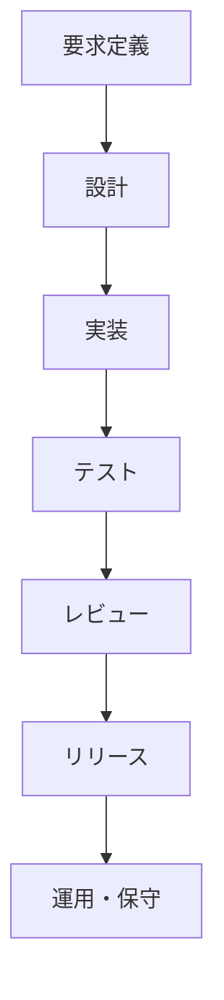

<!-- _class: title -->

# スライドプレビュー

## Marp機能の概説

---

<!-- _class: section -->

## Part I

# 章表示

---

## Marp プレビュー機能

このファイルは、本ツールで Marp 形式のスライドをそのままプレビューできることを示すサンプルです。

- フロントマターに `marp: true` を書くだけで自動切替
- `P` キーで デッキモード（1 枚ずつ表示）に切替
- `←` / `→` でスライド移動、`F` でフルスクリーン
- `theme: indigo` のように `assets/marp/*.css` の独自テーマも指定可能

---

## 数式と画像

Marp 標準の KaTeX で数式が描画されます。

$$
\int_{0}^{\infty} e^{-x^2}\, dx = \frac{\sqrt{\pi}}{2}
$$

インライン数式 $E = mc^2$ もそのまま動きます。

---

## ローカル画像

相対パスのローカル画像は `/userfile/` プロトコルルート経由で遅延読み込みされます（HTML エクスポート時のみ base64 に埋め込まれます）。


---

## 動画 / YouTube

画像記法 `` を流用して動画も埋め込めます。ローカル動画は `<video controls>`、YouTube URL はレスポンシブ `<iframe>` になります。


---

## ローカル動画

`` でこのファイルからの相対パス動画を再生（シーク対応）。`X` エクスポート時は `media/` にコピーされます。Marp ネイティブの `` 記法でも動画サイズを指定できます。


---

## Mermaid 図

本ツールの拡張なので Marp 単体では描画されませんが、こちらは正しく SVG に展開されます。先頭に `scale: <倍率>` を書くと図全体を拡大／縮小できます（例: `scale: 1.5` で 150%）。

```mermaid
scale: 1.5
graph LR
  A[編集] --> B[保存]
  B --> C{Marp?}
  C -->|Yes| D[スライド表示]
  C -->|No| E[通常プレビュー]
```

---

## ABC 楽譜

本ツールの拡張により、`abc` フェンスで [ABC 記譜法](https://abcnotation.com/) が五線譜として描画されます。図は左右中央に配置されます。

```abc
X:1
T:メヌエット風
M:3/4
L:1/4
K:G
D | G2 A | B2 c | d2 e | d3 | c2 A | B2 G | A2 D | G3 |
```

---

## CSV テーブル

```csv
項目,Q1,Q2,Q3,Q4
売上,120,150,170,210
利益,30,42,55,68
```

---

## Plotly チャート (外部CSV)

```plotly
file: data/sales.csv
type: line
x: month
y: [revenue, cost]
names: [Revenue, Cost]
title: Monthly P&L
layout:
  height: 420
  width: 600
  margin: { t: 48, r: 24, b: 48, l: 56 }
  legend: { orientation: h, y: -0.2 }
```

---

<!-- _class: split -->

## Plotly: 3D サーフェス

### 二次元 sinc 関数

原点から等方的に広がる波は、半径 $r$ だけの関数として

$$
z=\frac{\sin r}{r},\qquad r=\sqrt{x^{2}+y^{2}}
$$

と書ける。中心の主極大 $z=1$ を頂点に、同心円状の起伏が外へ向かって続く。

- 節（$z=0$）は $r=\pi,\ 2\pi,\ 3\pi,\dots$ に等間隔で並ぶ
- 振幅は $1/r$ で減衰し、遠方では平面に漸近する
- 最初の極小は $r\simeq4.49$ で $z\simeq-0.22$

+++

```plotly
file: data/ripple.csv
type: surface
layout:
  height: 470
  margin: { t: 0, r: 0, b: 0, l: 0 }
  paper_bgcolor: rgba(0,0,0,0)
  scene: { camera: { eye: { x: 1.5, y: 1.5, z: 0.75 } } }
config:
  displayModeBar: false
```

---

## シンタックスハイライト

```rust
fn main() {
    println!("Hello, Marp!");
}
```

---

## タスクリスト

GitHub 形式のチェックボックス（`- [ ]` / `- [x]`）は Marp スライドでも通常プレビューと同じチェックボックスとして表示され、クリックで付け外しできます（この `.md` に書き戻されます）。

- [x] 企画・要件定義
- [x] 設計
- [ ] 実装
- [ ] レビュー
- [ ] リリース

---

## 定義リスト

用語を 1 行で書き、次の行を `: ` で始めると定義リストになります。`: ` の行を続ければ 1 つの用語に複数の説明を並べられます。

Marp
: Markdown からスライドを生成するフレームワーク。

プレビューモード
: `P` キーで切り替わる 3 種類の表示。
: スクロール / デッキ / 一覧。

オートフィット
: `A` キーで切り替わる本文の自動縮小。

  - はみ出したスライドの本文だけを縮小
  - タイトル・ヘッダー・フッターは原寸のまま

---

## 脚注

Marp 標準では脚注は未対応ですが、本ツールでは有効です[^impl]。参照元と同じスライドの下部に、そのスライドの脚注だけがコンパクトに表示されます[^placement]。番号は全スライド通しで振られます[^export]。

[^impl]: `[^id]` 構文を marp-core に渡す前にプレースホルダ化し、レンダリング後に `<sup>` に戻す方式です。
[^placement]: 各スライド末尾に小さめのフォントで配置されます。
[^export]: HTML エクスポートでもそのまま保持されます。

---

## 脚注の複数スライド参照

同じ脚注を別のスライドから再度参照すると[^impl]、本文はこのスライドの下部にも表示され、番号は前のスライドと同じままです。ホバーすると、いま見ているスライド側のコピーがツールチップに出ます。

---

<!-- _class: split -->

## 2カラムレイアウト

### 基本記法

Marp 標準では生 HTML が必要な「左右分割」を、`<!-- _class: split -->` ディレクティブと `+++` 区切りだけで実現できます。

- 左側に説明文
- 右側に箇条書きや画像
- `+++` を行頭単独で書くと列が分かれる

+++

### 使いどころ

- ビフォー / アフターの比較
- 図と説明を並べる
- メリット / デメリット表

コードフェンス内の `+++` は分割されません:

```diff
+++ a/file.txt
--- b/file.txt
```

---

## スライド途中からのカラム

通常は1カラムで導入文を書きます。`<!-- _class: split -->` と違いスライド全体を分割しません。

::: columns
### 左カラム

- `::: columns` で領域を開始
- 内部の `+++` で列を区切る
- 列内に `::: center` も使える

+++

### 右カラム

::: center
**中央寄せ**も列内で機能
:::
:::

`:::` で領域を閉じると、再び全幅の1カラムに戻ります。`::: columns-3` のように列数を明示することもできます（既定は `+++` の数で自動）。

---

## 強調メッセージ

`::: message` … `:::` で囲むと、中央寄せ＋大きな太字＋上下のアクセント罫で強調表示されます。
結論やキーメッセージを読みやすく提示したいときに使います。

::: message
結論：このまま進めて問題ありません
:::

`::: center` が配置だけなのに対し、`::: message` は文字サイズ・太さ・罫線で視覚的に強調します。

---

## インラインスタイル

文の一部だけ色・サイズ・書体を変えるには `[テキスト]{属性}` 記法を使います。

- 売上は[前年比 +28%]{color=#e91e63 size=large weight=bold}で着地
- 注記は[小さめのグレー]{color=gray size=small}で
- [明朝体での引用]{font=serif}や[等幅コード風]{font=mono}も可

スライドでも通常プレビューと同じ構文がそのまま効きます（`color`/`size`/`font`/`bg`/`weight`/`valign`）。

---

## ルビ（振り仮名）

読み仮名は `｜漢字《かんじ》`、`漢字《かんじ》`、`{漢字|かんじ}` の 3 通りで書けます。

- 創業は明治二十七年、｜坪内逍遥《つぼうちしょうよう》の時代
- 主力製品《せいひん》の出荷台数《だいすう》は前年比 128%
- 読みを区切るとモノルビ: {漢字|かん|じ}

コードスパンの中（`｜漢字《かんじ》`）は変換されないので、記法そのものも書けます。

---

<!-- _class: split-3 -->

## 3カラム特徴紹介

### シンプル

`+++` を 2 回書くだけで 3 カラムに展開されます。`split-4` で 4 カラムまで対応。

+++

### 柔軟

各カラムには見出し、リスト、コード、画像、数式、脚注、mermaid まで配置できます。

+++

### 安全

`html: false` を維持したまま実現しているため、Marp 標準のセキュリティモデルから逸脱しません。

---

<!-- _class: split -->

## カラム内の楽譜

### 説明

`split` レイアウトの各カラムにも `abc` 楽譜を配置できます。

- 左に解説、右に譜面
- SVG に viewBox を付与して描画するので、狭いカラム幅でも途切れず自動で縮小

+++

### 譜面例

```abc
X:1
T:練習曲
M:4/4
L:1/4
K:C
C E G c | c G E C | D F A d | d A F D |
```

---

## Markwhen タイムライン

**markwhen** ブロックは図として左右中央に配置されます。

```markwhen
---
title: ロードマップ
#plan: blue
#dev: green
---

# フェーズ
2024-01 / 2024-03: 企画 #plan
2024-03 / 2024-08: 開発 #dev
2024-09: ローンチ
```

---

## tikz-cd 可換図式

**tikzcd** ブロックは WASM 版 TeX で可換図式を描画し、図として左右中央に配置されます（斜め矢印も可）。

```tikzcd
A \arrow[r, "f"] \arrow[d, "g"'] & B \arrow[d, "h"] \\
C \arrow[r, "k"']                & D
```

---

<!-- _class: split -->

## Kataskeve — 2 カラムに収まる幾何図

左カラムは平面幾何（インライン SVG）。`viewBox` を持つので狭いカラムでも
**クリップされずに縮小**されます。

+++

```kataskeve
grid: on
axes: on
unit: 46
A = point(0, 0)
B = point(4, 0)
C = point(0, 3)
polygon(A, B, C)
I = incenter(A, B, C)
circle(I, distance(I, foot(I, line(A, B)))) color=#2980b9
mark right_angle(B, A, C)
I color=#2980b9
label I "I" pos=NE
```

---

## Kataskeve3D — 立体幾何（ペン画風）

**kataskeve3d** ブロックは陰線処理と点描陰影つきのラスタ図を描き、図として左右中央に配置されます。

```kataskeve3d
view: tilt=24 yaw=30
unit: 62
shading: on
shading_density: 0.7
width: 620
height: 330
T = torus(point(0,0,0), vector(0,0,1), 2, 0.7)
cut(T, bitangent_plane(T, family=0)) open
```

---

## フェインマン図（feynmark）

**feynman** ブロックは [feynmark](https://github.com/yvvakimoto/feynmark) が線種・運動量ラベル込みで自動レイアウトし、図として左右中央に配置されます。ラベルは KaTeX で組版されます。

```feynman
diagram tree {
  in  e1: $e^-$,  e2: $e^+$
  out m1: $\mu^-$, m2: $\mu^+$
  e1 -- [fermion] a -- [fermion] e2
  a  -- [photon, momentum=$q$] b
  m2 -- [fermion] b -- [fermion] m1
}
```

---

## 文中の大きな図（重ならない）

見出しと本文のあとに大きな図を置いても、図はドキュメント順に普通に流れ、見出し・本文と重なりません（上下の自動中央寄せは廃止）。図がはみ出す場合は自動縮小（`A`、既定 ON）が本文を縮めて 1 枚に収めます。

> 注意：`A` を OFF にした場合や、図が大きすぎて縮小の下限（0.5 倍）を超える場合は、収まりきらない**下端がクリップ**されます（重なりではなくクリップ）。図の下に重要な文章を置くときはこの点に注意してください。



---

## 上下・左右中央寄せ `::: vcenter`

`::: vcenter` … `:::` で囲むと、残りスペースの上下・左右とも中央に配置されます。図 1 枚を中央に据える「センター図スライド」に便利です。

::: vcenter

:::

---

## スライドの自動縮小（はみ出し時）

1 枚に収まりきらないほど内容が多いスライドは、`A` キーが ON のとき（既定）自動縮小されて全体が 1 枚に収まります。`A` キーで OFF にすると縮小せず、本文だけをスクロールバーで下端まで追えます（タイトル／ヘッダー／フッターは固定）。

- 行 1: **上のタイトル（H2）・ヘッダー・フッターは固定サイズのまま**、本文エリアだけが縮小されます（スライド間でタイトルの大きさが揃います）。
- 行 2: 長文の箇条書きをたくさん並べても、下端からはみ出さずに収まります。図表スライドも本文＋図表エリアだけを縮小。
- 行 3: 縮小率の下限は 0.5。それ以上はみ出す分、および `A` を OFF にしたときのはみ出し分は、本文エリアがスクロール領域になっているのでスクロールバー（マウスホイール可）で追えます。分割 / カラムスライドはレイアウトの都合でスライド全体を一律縮小します。
- 行 4: スクロール / デッキ / リストのどのモードでも同じ挙動です（`A` OFF なら本文をスクロールしてこの下の行まで読めます）。
- 行 5: HTML エクスポートにも縮小結果がそのまま反映されます。
- 行 6: ダミー行。
- 行 7: ダミー行。
- 行 8: ダミー行。
- 行 9: ダミー行。
- 行 10: ダミー行。
- 行 11: ダミー行。
- 行 12: ダミー行。
- 行 13: ダミー行。
- 行 14: ダミー行。
- 行 15: ダミー行。
- 行 16: ダミー行。
- 行 17: ダミー行。
- 行 18: ダミー行。
- 行 19: ダミー行。
- 行 20: ダミー行。これだけ並ぶと通常はスライド下端からはみ出します。

---

## リンク検証（戻る/進むでスライド位置を保持）

別の `.md` ファイルへのリンクをクリックすると、そのファイルがこのビューアで開きます。**戻る（`Alt+←`）で戻ってきたときに、離れる直前に見ていたスライドが復元されます**（先頭スライドには戻りません）。

- [クロスファイルリンクのサンプルへ](./links.md)
- [プレーンな Markdown サンプルへ](./sample.md)

### 検証手順

1. デッキモード（`P`）でこのスライドを表示する。
2. 上のリンクを 1 つクリックして別ファイルへ移動する。
3. `Alt+←`（または WebView2 の右クリック「戻る」／マウスの戻るボタン）で戻る。
4. **このスライドがそのまま復元される**ことを確認する（`Alt+→` で進んでも同様に位置が保たれる）。
