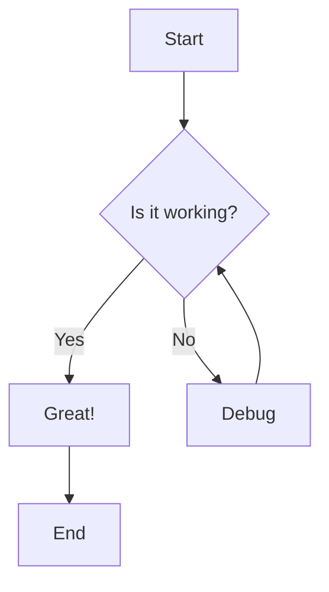
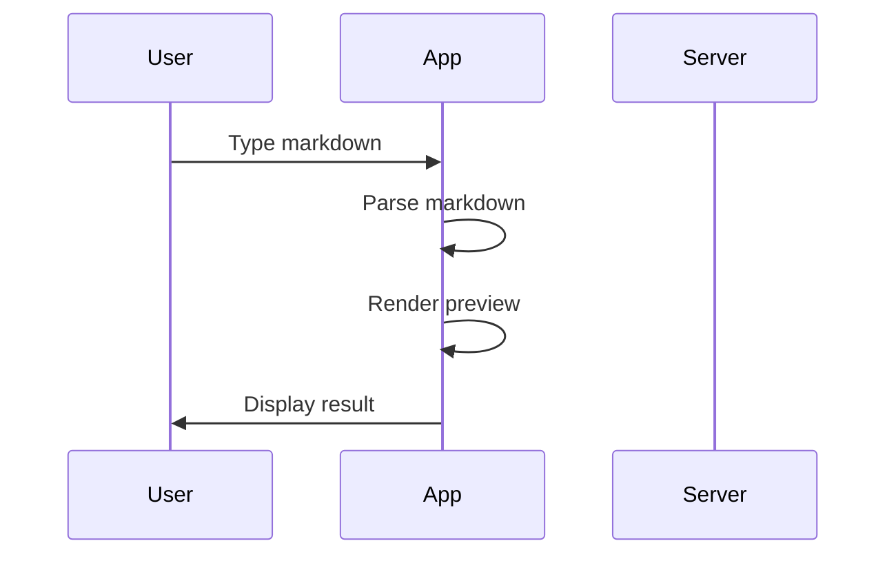
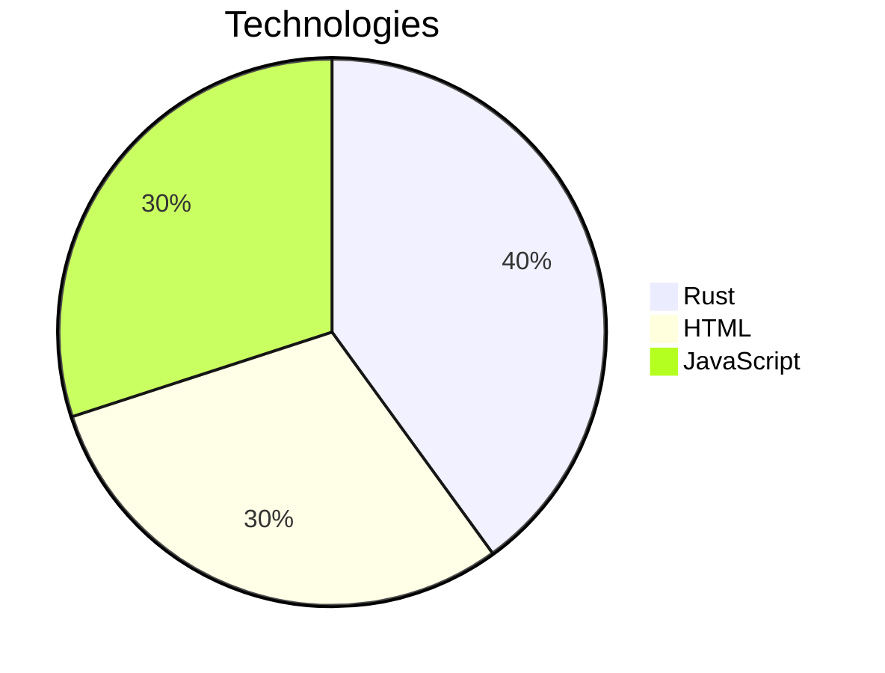

# Markdown Previewer

Welcome to the **Markdown Previewer** with Mermaid support!!

## Features

- Real-time markdown preview
- Mermaid diagram rendering
- GitHub-flavored markdown support
- Syntax highlighting for code blocks
- Clean, responsive interface

## Text Formatting

You can make text **bold**, *italic*, or ***both***. You can also use ~~strikethrough~~.

## Lists

### Unordered List
- Item 1
- Item 2
  - Nested item 2.1
  - Nested item 2.2
- Item 3

### Ordered List
1. First item
2. Second item
   - 子要素は 3 スペースでマーカー直後のカラムに揃える (CommonMark / GFM 規約)
   - エディタ側の Tab はこの幅にスナップする
3. Third item

### Ordered List (2-digit markers)
8. eighth
9. ninth
10. tenth
    - 2 桁マーカー配下は 4 スペース字下げ

## Code

Inline code: `const x = 42;`

Code block:
```javascript
function greet(name) {
    console.log(`Hello, ${name}!`);
}

greet("World");
```

## Blockquote

> This is a blockquote.
> It can span multiple lines.

## Table

| Feature | Supported |
|---------|-----------|
| Markdown | ✓ |
| Mermaid | ✓ |
| Live Preview | ✓ |

## Links and Images

[Visit GitHub](https://github.com)


### Image sizing (Obsidian-style pipe syntax)

Width only — ``:


Width × height — ``:


Height only — ``:


Scale factor — ``:


## Mermaid Diagrams

### Flowchart


### Sequence Diagram


### Pie Chart


## Horizontal Rule

---

### Hyperlink

- [Math](./math.md)
- [Syntax highlighting](./syntax.md)
- [Zukai（図解）diagrams](./zukai.md)
- [日本語ファイル名テスト](./日本語ファイル.md)

### Footnote

これは脚注の例です[^1]。
[^1]: ここが脚注の内容です。

## That's it!

Enjoy using the Markdown Previewer!

