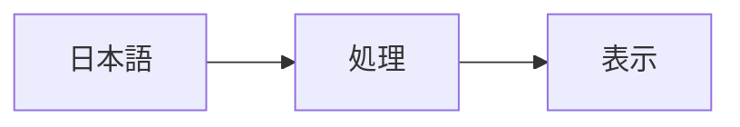

# 日本語ファイル名テスト

このファイルは、**日本語のファイル名**と相対パスが正しく解決されることを確認するためのサンプルです。

## 画像（相対パス）

## Mermaid

```mermaid
graph LR
    A[日本語] --> B[処理]
    B --> C[表示]
```

## 数式

インライン: $\alpha + \beta = \gamma$

$$\sum_{i=1}^{n} i = \frac{n(n+1)}{2}$$
