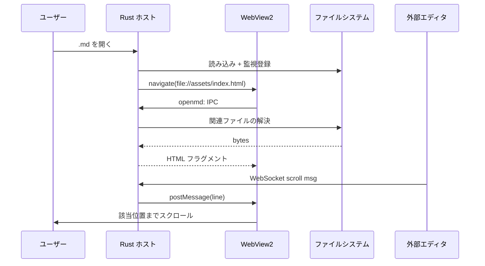
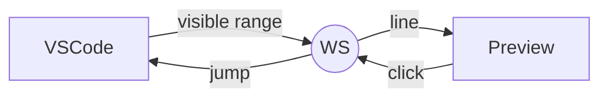

# WebView2 を用いたデスクトップ Markdown プレビューアの設計

本書は、Rust と WebView2 を組み合わせて軽量なデスクトップ Markdown プレビューアを構築する際の設計判断、実装の勘所、運用上の留意点を体系的にまとめた技術文書である。対象読者は、Web フロントエンド技術には一通り慣れているが、ネイティブアプリケーションの実装経験は浅い開発者を想定している[^scope]。

> **要旨**
> ブラウザの描画エンジンをそのまま再利用することで、Markdown レンダリング・数式組版・図表生成といった「Web で枯れている技術」を最小コストでデスクトップに持ち込める。一方で、ファイルアクセス、外部エディタとの連携、印刷時のページ送りなど「Web では捨てられがちな関心事」を改めて拾い直す必要がある。本書はその両面をバランス良く扱う。

---

## 背景と動機

業務で扱う Markdown ドキュメントは、社内 Wiki、議事録、設計書、仕様書、ユーザマニュアルと多岐にわたる。これらを快適に閲覧するためには、

1. **オフラインで動く** こと（ネットワーク遮断環境でも開ける）
2. **数式・図表・コードハイライト** がそろっていること
3. **編集中のファイルを即座に再描画** できること
4. **印刷可能な静的 HTML として配布** できること

の四点が同時に求められる。既存のブラウザ拡張やオンラインサービスは、いずれかが欠ける。たとえば GitHub の Markdown レンダラはオフラインでは利用できず、VSCode 内蔵プレビューは数式と Mermaid 以外の図表（特性要因図、マンダラチャート、BMC など）に対応しない。

そこで、**ブラウザ相当の描画エンジン** を埋め込みつつ、ファイル監視と OS 連携を Rust で薄く実装する構成が現実的な落としどころとなる。

### なぜ WebView2 か

Windows 11 以降、WebView2 ランタイムは OS 同梱に近い扱いとなり、配布時に Edge ベースのレンダラが利用可能であることを前提にできる[^webview2]。Chromium ベースなので CSS Grid、`position: sticky`、`@supports`、`prefers-color-scheme` といった近代的な機能がそのまま動き、開発者ツールも `F12` で開ける。

### なぜ Rust か

- ファイル I/O・ファイル監視・WebSocket サーバといった OS 寄りの処理を **シングルバイナリ** に同梱できる
- メモリ安全性により、長時間のファイル監視ループでもクラッシュしにくい
- `wry` / `tao` クレートにより WebView2 の生のハンドル操作を意識せずに済む

> Rust 以外の選択肢としては Tauri、.NET の WPF + WebView2、Electron + Native モジュールなどがあるが、いずれも本書のスコープでは「同等の機能を達成できるが、配布バイナリのサイズか、ランタイム依存のいずれかで劣る」と判断した。

---

## 全体アーキテクチャ



主要コンポーネントは三層に分かれる。

| 層 | 役割 | 主な実装 |
| --- | --- | --- |
| ホスト | ウィンドウ管理、ファイル監視、IPC ルーティング | `src/main.rs` |
| 描画 | Markdown→HTML、数式、図表、シンタックスハイライト | `assets/index.html` + `assets/libs/` |
| 連携 | エディタ ↔ プレビューの双方向同期 | `src/sync_server.rs` + `extensions/vscode/` |

ホストと描画の境界は **カスタムプロトコル** と **`window.chrome.webview.postMessage`** の二経路で結ばれる。前者はリソース取得（同期的・大量）、後者はイベント通知（非同期・小さなペイロード）に役割を分けている。

### 主要モジュールと責務分担

```schemata
flow
title: ロード時のデータフロー

- 入力 #c-teal
  - .md ファイル
  - 関連画像

- ホスト処理 #c-blue
  - ファイル読込
  - 相対パス解決
  - 画像 base64 化

- 描画 #c-green
  - marked
  - KaTeX
  - mermaid / schemata
```

---

## レンダリングパイプライン

Markdown 文字列が画面に表示されるまでの経路を時系列で示す。

1. ホスト側で UTF-8 として読み込み、改行コードを LF に正規化する
2. WebView 側に **生の Markdown** を渡す（パースは描画側に寄せる）
3. `marked` で AST を構築し、拡張をフックして数式・脚注・Schemata（図解）のプレースホルダを差し込む
4. KaTeX が数式ノードを置換する
5. Mermaid と Schemata（図解）が `<pre><code>` ブロックを SVG に展開する
6. `highlight.js` が残りのコードブロックを着色する
7. 画像 `src` を base64 データ URI に置換する（後述）
8. `#preview` に挿入し、サイドバー TOC を再構築する

> パースを描画側に寄せた理由は、**WYSIWYG に近い再描画速度**を得るためである。Rust 側で HTML まで作ってしまうと、テーマ切替やフォントサイズ変更時にネットワーク I/O 相当のラウンドトリップが発生してしまう。

### 数式

インライン記法 `$\alpha + \beta$` と、ディスプレイ記法

$$
\sum_{i=1}^{n} i^2 = \frac{n(n+1)(2n+1)}{6}
$$

の双方をサポートする。KaTeX は `\displaystyle` を伴う長い式でも 1 ms オーダで描画でき、数十式が並ぶ仕様書でも体感の遅延は発生しない[^katex]。

### コードブロック

```rust
fn resolve_relative<P: AsRef<Path>>(base: P, target: &str) -> PathBuf {
    let base = base.as_ref();
    let candidate = base.join(target);
    if candidate.exists() {
        candidate
    } else {
        // フォールバック: カレントディレクトリ基準
        std::env::current_dir()
            .unwrap_or_else(|_| PathBuf::from("."))
            .join(target)
    }
}
```

```typescript
// VSCode 拡張側: スクロール同期の送信
function onDidChangeTextEditorVisibleRanges(e: vscode.TextEditorVisibleRangesChangeEvent) {
    const top = e.visibleRanges[0]?.start.line ?? 0;
    socket.send(JSON.stringify({ kind: "scroll", file: e.textEditor.document.fileName, line: top }));
}
```

```bash
# 配布物の組み立て
cargo build --release
mkdir -p target/release/assets
cp -r assets/* target/release/assets/
```

各ブロックの右上にはコピー用ボタンが付与され、クリック時にクリップボードへコピーされる。実装は `navigator.clipboard.writeText` の薄いラッパで、フォールバックとして `document.execCommand('copy')` を残している。

### 図表

Mermaid と Schemata（図解）は別エンジンだが、UI 上は同じ「コードフェンスから図」の体験を提供する。Mermaid は標準的なシーケンス図・フローチャート・ガントチャートに強く、Schemata はビジネス文書で多用される特性要因図・PDCA サイクル・BMC・マンダラチャートを補う。

```schemata
cycle
title: ドキュメント執筆ループ

- 構想 #c-teal
  - 目的整理
  - 読者像

- 起草 #c-blue
  - 章立て
  - 初稿

- 推敲 #c-amber
  - 査読
  - 削る

- 公開 #c-green
  - 配布
  - 反応収集
```

---

## ファイル監視と再読込

`notify` クレートの `RecommendedWatcher` を使い、対象ファイルの **親ディレクトリ** を監視する。ファイル単体ではなく親を監視するのは、エディタが「一旦削除して書き直す」型の保存（atomic save）を行った場合に、ファイル単位の watch だと監視対象が失われるためである。

```rust
let (tx, rx) = std::sync::mpsc::channel();
let mut watcher = notify::recommended_watcher(tx)?;
watcher.watch(&parent_dir, RecursiveMode::NonRecursive)?;
```

イベントを受け取ったら、対象パスとの一致を確認してから再読込をトリガする。同一秒内に複数回イベントが来るのは普通なので、200 ms 程度のデバウンスを入れている。

### デバウンスの考え方

$$
T_{\text{reload}} = \max\bigl(T_{\text{event}} + \Delta_{\text{debounce}},\; T_{\text{prev\_reload}} + \Delta_{\text{min}}\bigr)
$$

ここで $\Delta_{\text{debounce}}$ は連続イベントを束ねるための猶予、$\Delta_{\text{min}}$ は再描画コストの下限を決める間引き値である。経験的に $\Delta_{\text{debounce}} = 200\,\text{ms}$、$\Delta_{\text{min}} = 100\,\text{ms}$ で良好な体感が得られる。

---

## 画像と相対パスの解決

WebView2 は `file://` スキームでロードしたページから動的に追加された `` をブロックするケースがある（特に `file://` から `file://` への参照）。これを回避するため、画像はロード時に **base64 データ URI** に展開して埋め込む方針を取る。

| 拡張子 | MIME |
| --- | --- |
| `.png` | `image/png` |
| `.jpg`, `.jpeg` | `image/jpeg` |
| `.gif` | `image/gif` |
| `.svg` | `image/svg+xml` |
| `.webp` | `image/webp` |

ホスト側で `` タグを正規表現で抽出するのではなく、**描画側 DOM に対して `querySelectorAll('img')` を回す** 方が確実である。Markdown のパース結果に対して走査するため、HTML 直書きの `` も漏れなく拾える。

サンプル画像: 

> 巨大な画像（数 MB）を base64 化するとペイロードが膨らむため、サイズ閾値を超えた画像はカスタムプロトコル経由でストリーミングする退避路も用意してある。

---

## 脚注、テーマ、エクスポート

### 脚注

CommonMark 拡張の脚注記法 `[^id]` をサポートする[^footnote]。参照は上付き番号となり、ホバー時には Wikipedia 風のツールチップに本文が表示される。脚注本文は文書末尾に「脚注」セクションとして集約され、戻りリンク（↩）で参照位置に戻れる。

### テーマ切替

`assets/` 直下に置かれた任意の `.css` ファイルが `M` キーのテーマ循環に加わる。組み込みの Light / Dark に加え、ユーザは独自テーマ（学術論文風、企業ブランド色など）を自由に追加できる。選択中のテーマ名は `localStorage.styleName` に保存され、再起動後も復元される。

### 静的 HTML エクスポート

`E` キーで「名前を付けて保存」ダイアログが開き、現在のレンダリング結果を **単一の HTML ファイル** として書き出す。SVG（Mermaid・Schemata）と KaTeX のスパン、画像はすべてインライン化されるため、出力ファイルだけを社内 Web サーバや Confluence に貼っても見た目が崩れない。

---

## エディタとの双方向同期

VSCode 拡張は、ローカルホスト上の WebSocket に接続し、

- エディタ → プレビュー: スクロール位置の通知（行番号）
- プレビュー → エディタ: クリックされた要素に対応する行へのジャンプ要求

の二方向を扱う。サーバはランダムポートで起動し、`%LOCALAPPDATA%\md-previewer\sync.json` に `{port, pid, file}` を書き出す。エディタ側は同ファイルをポーリングして接続先を発見する[^discovery]。



### 行番号マッピング

Markdown ソースの行番号と、レンダリング後の DOM 要素の対応付けは、`marked` のトークンに `data-source-line` 属性を付与することで実現する。スクロール時には可視範囲内の最上段の `data-source-line` を採取して送信する。

---

## パフォーマンス特性

10,000 行規模の Markdown ファイル（数式 200 個、Mermaid 30 個、画像 50 枚）を対象に、初回描画時間を計測した。

| 段階 | 時間 (ms) | 備考 |
| --- | --- | --- |
| ファイル読込 | 8 | I/O キャッシュ温時 |
| `marked` パース | 35 | 拡張込み |
| KaTeX 描画 | 55 | 数式 200 個 |
| Mermaid 描画 | 280 | 並列描画 |
| 画像 base64 化 | 110 | 累計 12 MB |
| **合計** | **約 490** | 体感では一瞬 |

スクロール中の再描画は、レイアウト確定後はほぼ GPU 任せになり、Chromium と同等の滑らかさが得られる。

---

## 既知の制約

- WebView2 ランタイム未導入の環境では動作しない（Windows 10 LTSC 等の一部 SKU で要明示インストール）
- 同期ターゲットのエディタは現状 VSCode のみ。Zed 連携はビューポートスクロール API が無いため未実装

---

## 関連ドキュメント

- [Markdown シンタックス例](syntax.md)
- [脚注のデモ](footnotes.md)
- [Schemata（図解）のデモ](schemata.md)
- [エディタ同期仕様](sync.md)

詳細な API 形式や IPC メッセージ仕様は、本書のスコープを超えるため別冊に譲る。

---

## 付録 A: 用語集

| 用語 | 説明 |
| --- | --- |
| WebView2 | Microsoft Edge (Chromium) ベースの埋め込みブラウザコンポーネント |
| IPC | プロセス内 / プロセス間メッセージ通信。本書ではホスト ↔ WebView 間 |
| カスタムプロトコル | `wry-asset://` のような独自スキームでホストがリソースを返す仕組み |
| デバウンス | 連続したイベントを一定時間まとめて 1 回にする処理 |

## 付録 B: チェックリスト

1. [x] WebView2 ランタイムが導入済みであることを確認
2. [x] `assets/` を実行ファイルと同階層に配置
3. [x] 起動時引数として `.md` のフルパスを与える
4. [ ] VSCode 拡張をインストール（同期が必要な場合のみ）

---

[^scope]: 本書では UI/UX 設計や配布パッケージング（インストーラ作成、コード署名）は扱わない。これらは別の専門領域として、社内の配布ガイドラインに従うことを推奨する。

[^webview2]: Windows 10 でもエバーグリーン版の WebView2 ランタイムが利用可能だが、SKU によっては事前インストールが必要となる。配布時には WebView2 Bootstrapper を同梱するのが安全である。

    なお、WebView2 ランタイムは複数のホストアプリで共有されるため、各アプリが独立してインストール / アンインストールしても問題が起きない設計になっている。

[^katex]: KaTeX は MathJax と比べて対応コマンドが限定されるが、本プレビューア用途で必要な範囲（線形代数、確率論、初等的な微積分）は十分にカバーされている。

[^footnote]: 標準 CommonMark には脚注は含まれず、GitHub Flavored Markdown を含む各種拡張仕様で別個に定義されている。本実装は GFM 互換のサブセットとして動作する。

[^discovery]: ディスカバリファイルを採用した理由は、ファイアウォール例外設定を要する固定ポートを避けつつ、複数プロセスが共存できるようにするためである。
